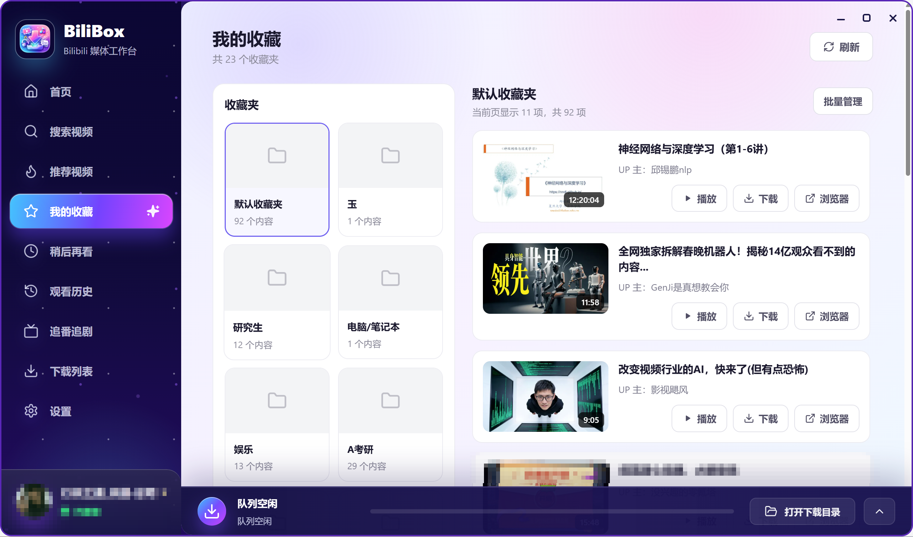
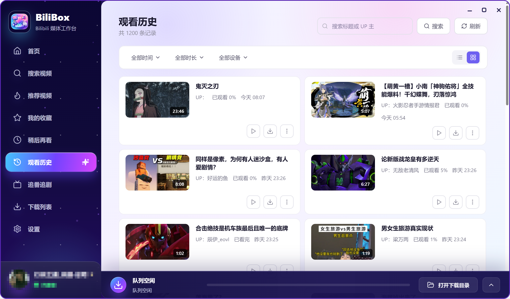
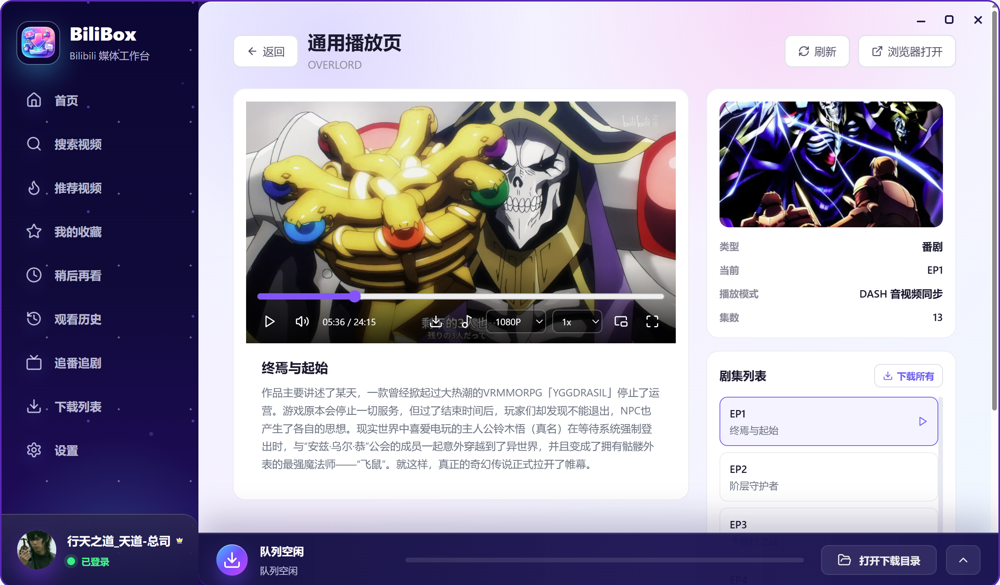

<div align="center">
  
  <h1>BiliBox</h1>

  <p>
    一个高颜值、桌面级、开箱即用的 Bilibili 媒体工作台。
  </p>
  <p>
    <strong>搜索、收藏、稍后再看、观看历史、追番追剧、在线播放与后台下载，一站完成。</strong>
  </p>

  <p>
    <a href="#功能亮点">功能亮点</a>
    ·
    <a href="#界面预览">界面预览</a>
    ·
    <a href="#快速开始">快速开始</a>
    ·
    <a href="#常见问题">常见问题</a>
  </p>

  <p>
    
    
    
    
    
  </p>
</div>

---

## 为什么选择 BiliBox

BiliBox 不是一个只会粘贴链接的下载器，而是面向日常使用的 Bilibili 桌面媒体工作台。它把常用入口、账号数据、在线播放、下载队列和本地配置集中在一个现代化桌面应用里，让找视频、看视频、存视频变成一个连续的流程。

- **桌面体验优先** - 基于 Tauri 2 构建，体积更轻，启动更快，系统集成更自然。
- **真实业务闭环** - 搜索、推荐、收藏夹、历史、稍后再看、追番追剧、下载队列都接入实际业务逻辑。
- **播放和下载联动** - 从任意列表进入播放页，确认资源后可直接加入后台下载。
- **适合分发给非开发用户** - 三端 Release 构建会下载并校验真正可独立运行的 FFmpeg/FFprobe，将其放入 `env/` 后封装进安装版与便携版。
- **本地优先** - 便携版将登录态、用户信息和下载数据写入程序同级 `data/`；安装版使用系统应用数据目录，数据均不会上传。

## 功能亮点

### 账号与登录

- 二维码登录、Cookie 登录、内置浏览器登录
- 自动保存登录状态到本地，启动后自动恢复账号信息

### 内容发现

- 推荐视频、聚合搜索（支持关键词/BV号/AV号/链接）
- 搜索结果支持排序、发布时间、视频时长筛选
- 我的收藏、稍后再看、观看历史、追番追剧
- 浏览页面支持本地缓存，手动刷新时重新获取最新数据

### 播放能力

- 多清晰度动态展示、全屏、画中画、双击切换全屏
- 使用 Tauri 内部媒体协议代理远程媒体资源
- 下载完成的视频可直接从首页或下载列表进入播放
- 分集视频可在播放页一键加入全部剧集下载任务

### 下载管理

- 后台下载，不强制跳转页面；支持多选批量操作
- 底部上拉面板实时展示下载进度，最新任务优先显示
- 支持 FFmpeg/FFprobe 自动发现与分发目录打包
- 下载清晰度按目标视频可用画质展示，自动采用最高可用画质

### 个性化设置

- 下载目录、默认清晰度、任务并发、分片并发配置
- 支持一键恢复默认设置，并保留当前账号登录状态

## 界面预览

### 首页


### 搜索视频


### 推荐视频


### 我的收藏



### 播放页面


### 下载队列


### 观看历史



### 追番追剧




## 技术栈

| 层级 | 技术 |
| --- | --- |
| 桌面容器 | Tauri 2 |
| 前端 | React 19、TypeScript、Vite |
| UI 与交互 | Zustand、Framer Motion、Lucide React、Radix UI |
| 后端 | Rust、Tokio、Reqwest、Serde |
| 媒体处理 | FFmpeg、FFprobe |

## 快速开始

### 方式一：下载发行版（推荐普通用户）

前往 [Releases](https://github.com/RoamerFly/Bilibili_Box/releases/latest) 页面下载对应平台的安装包或便携版；国内也可参考 [GitCode 镜像](https://gitcode.com/roverfly/Bilibili_box)。

| 平台 | 版本 |
| --- | --- |
| Windows | 安装版 `.exe` / 便携版 `.zip` |
| macOS | Apple Silicon `.dmg` / Intel `.dmg` |
| Linux | `.deb` / `.rpm` / 便携版 `.tar.gz` |

> macOS 首次打开可能提示"无法验证开发者"，请在 **系统设置 → 隐私与安全性** 中点击"仍要打开"。

### 方式二：源码运行（适合开发者）

**环境要求：**

| 依赖 | 建议版本 |
| --- | --- |
| Rust | 1.77.2 或更高 |
| Node.js | 18 或更高，推荐 LTS |
| npm | 随 Node.js 安装 |
| FFmpeg/FFprobe | 本地开发构建时需要 |

Windows 需要安装 Microsoft Visual C++ Build Tools，或安装 Visual Studio 2022 并勾选 **Desktop development with C++**。

**步骤：**

```bash
# 克隆项目
git clone https://github.com/RoamerFly/Bilibili_Box.git
cd Bilibili_Box

# 安装依赖
npm install
npm --prefix frontend install

# 开发模式运行
npm run tauri dev
```

## 项目结构

```text
bilibili-box/
  .github/workflows/         GitHub Release 自动构建工作流
  frontend/                 React 前端
    src/
      components/           通用组件和布局
      hooks/                前端 hooks
      lib/                  工具函数和类型定义
      stores/               Zustand 状态管理
      views/                首页、搜索、收藏、播放、下载等页面
  src-tauri/                Tauri/Rust 后端
    src/
      api/                  Bilibili API 封装
      config/               配置与本地数据路径
      download/             下载任务、分片、FFmpeg 集成
      plugin/               插件管理
      commands.rs           Tauri commands
      media_proxy.rs        内部媒体协议代理
  src-plugin/               插件相关 Rust 工程
  packaging/windows/        NSIS 安装包模板
  scripts/                  三端发布运行时准备脚本
  THIRD_PARTY_NOTICES.md    随包第三方工具许可说明
  build-windows.bat         Windows 分发构建脚本
  build-linux.sh            Linux 构建脚本
  build-macos.sh            macOS 构建脚本
```

## 常见问题

### Q: 下载的视频在哪里？

默认在程序目录下的 `download/` 文件夹。你可以在 **设置 → 下载目录** 中修改。

### Q: 为什么下载失败？

可能原因：
1. **未登录** - 部分视频需要登录才能下载
2. **网络问题** - 检查网络连接或尝试切换代理设置
3. **FFmpeg 缺失** - 确保使用的是官方发布的完整版本

### Q: 支持哪些视频画质？

支持 240P 到 8K 共 13 个级别，具体取决于视频源可用的最高画质。

### Q: 便携版和安装版有什么区别？

| 区别 | 便携版 | 安装版 |
|------|--------|--------|
| 数据位置 | 程序目录 `data/` | 系统应用数据目录 |
| 卸载 | 直接删除文件夹 | 使用系统卸载程序 |
| 适用场景 | U盘携带、多设备同步 | 长期使用 |

### Q: 如何导入/导出下载列表？

下载文件保存在当前用户的 `data/{user_name}/download/` 目录中，下载任务缓存保存在 `data/{user_name}/cache/download_tasks/`，便携版可直接复制整个 `data/` 文件夹。

## 免责声明

本项目仅用于学习、研究与个人数据管理。请遵守 Bilibili 用户协议、版权规则和当地法律法规。下载或缓存内容前，请确保你拥有相应权限。

## License

[MIT](./LICENSE)
