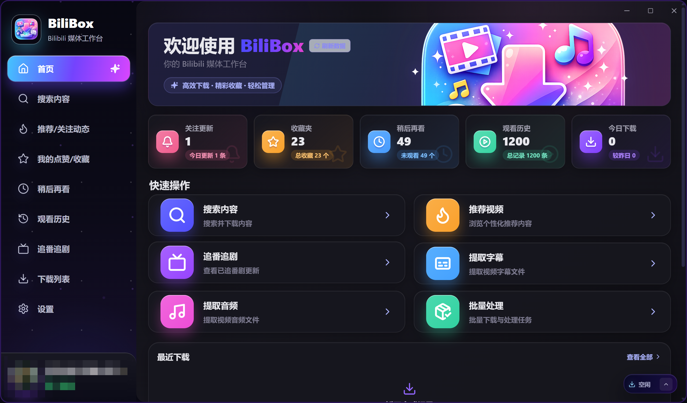
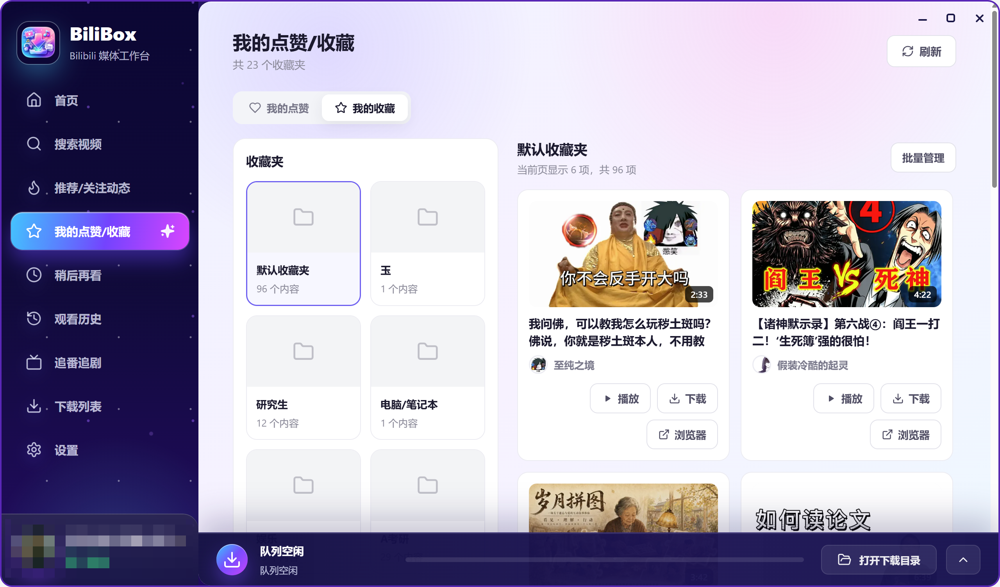
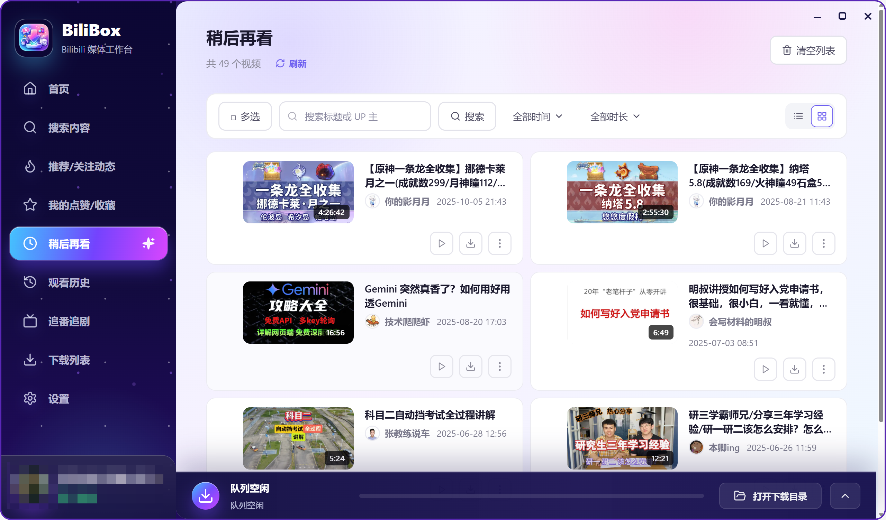
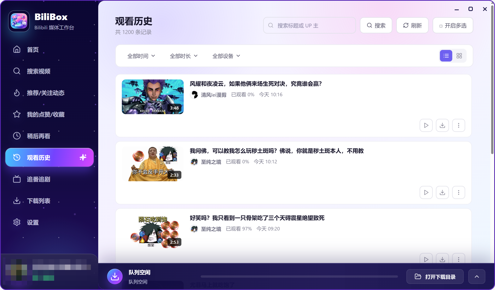
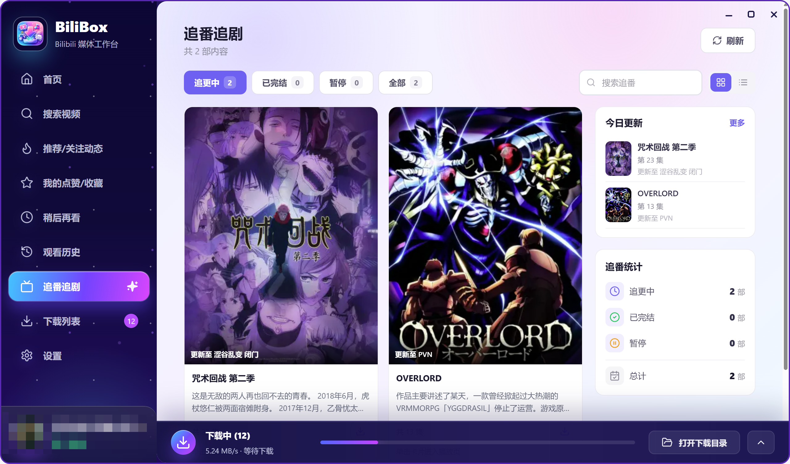
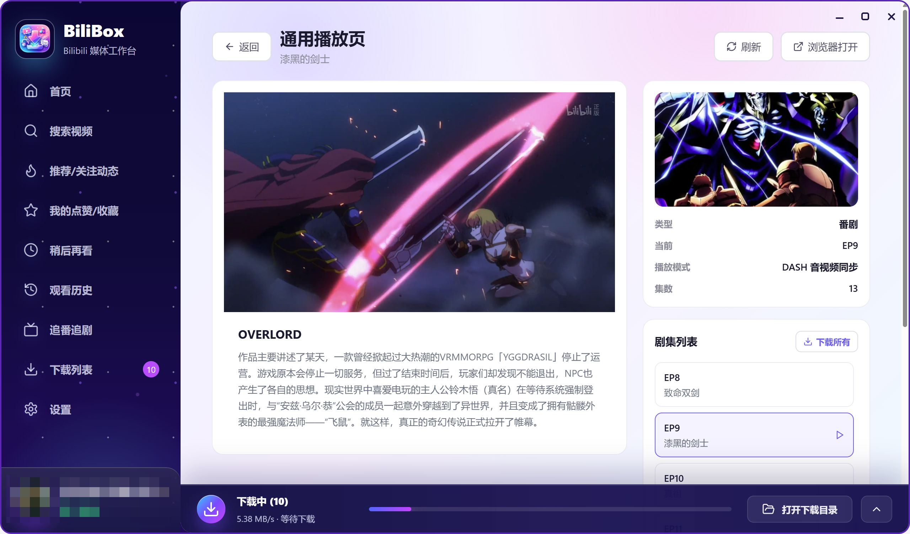
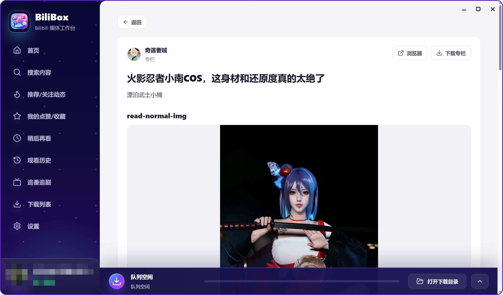
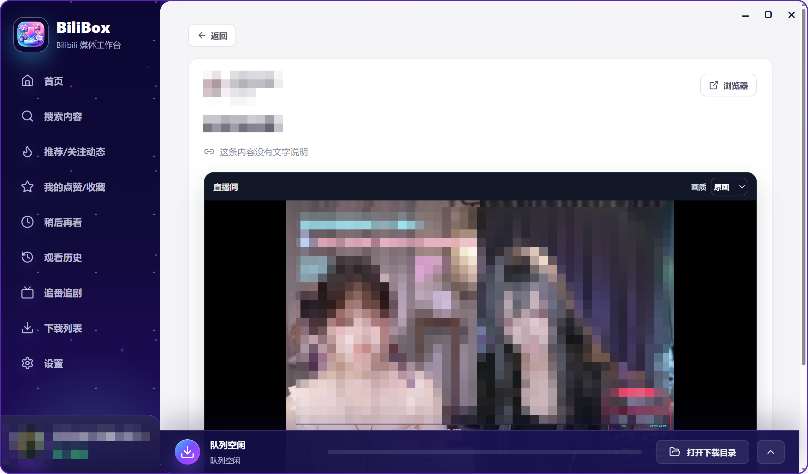

  
  <h1>BiliBox</h1>

  

    一个高颜值、桌面级、开箱即用的 Bilibili 媒体工作台。
  

  

    <strong>搜索、收藏、稍后再看、观看历史、追番追剧、在线播放与后台下载，一站完成。</strong>
  

  

    <a href="#功能亮点">功能亮点</a>
    ·
    <a href="#界面预览">界面预览</a>
    ·
    <a href="#下载发行版">下载发行版</a>
    ·
    <a href="#常见问题">常见问题</a>
    ·
    <a href="./OPEN_SOURCE.md">公开源码说明</a>
  

  

    
    
    
    
    
    
    
  

---

## 为什么选择 BiliBox

BiliBox 不是一个只会粘贴链接的下载器，而是面向日常使用的 Bilibili 桌面媒体工作台。它把常用入口、账号数据、在线播放、下载队列和本地配置集中在一个现代化桌面应用里，让找视频、看视频、存视频变成一个连续的流程。

- **桌面体验优先** - 基于 Tauri 2 构建，体积更轻，启动更快，系统集成更自然。
- **完整使用流程** - 搜索、推荐、收藏夹、历史、稍后再看、追番追剧和下载队列集中管理。
- **播放和下载联动** - 从任意列表进入播放页，确认资源后可直接加入后台下载。
- **适合普通用户** - Releases 提供 Windows、macOS 和 Linux 的安装版或便携版。
- **本地优先** - 登录状态、用户信息、配置和下载数据均保存在本机。

## 功能亮点

### 账号与登录

- 二维码登录、Cookie 登录、内置浏览器登录
- 自动保存登录状态到本地，启动后自动恢复账号信息

### 内容发现

- 推荐视频、聚合搜索（支持关键词、BV 号、AV 号和链接）
- 搜索结果支持排序、发布时间和视频时长筛选
- 我的收藏、稍后再看、观看历史、追番追剧
- 浏览页面支持本地缓存，手动刷新时重新获取最新数据

### 播放能力

- 多清晰度动态展示、全屏、画中画、双击切换全屏
- 下载完成的视频可直接从首页或下载列表进入播放
- 分集视频可在播放页一键加入全部剧集下载任务
- 番剧、影视、视频和专栏详情支持评论区展示

### 下载管理

- 后台下载，不强制跳转页面；支持多选批量操作
- 底部悬浮胶囊实时展示下载进度，最新任务优先显示
- 支持 FFmpeg / FFprobe 媒体处理
- 下载清晰度按目标视频可用画质展示，并支持默认画质设置

### 个性化设置

- 下载目录、默认清晰度、任务并发和分片并发配置
- 亮色、暗色与跟随系统主题
- 支持一键恢复默认设置，并保留当前账号登录状态

## 界面预览

### 首页

### 搜索内容

### 推荐 / 关注动态

### 我的点赞 / 收藏

### 稍后再看

### 播放页面

### 下载队列

### 观看历史

### 追番追剧

### 设置

### 专栏

### 直播

## 技术栈

| 层级 | 技术 |
| --- | --- |
| 桌面容器 | Tauri 2 |
| 前端 | React 19、TypeScript、Vite |
| UI 与交互 | Zustand、Framer Motion、Lucide React、Radix UI |
| 桌面运行时 | Rust、Tokio |
| 媒体处理 | FFmpeg、FFprobe |

## 下载发行版

前往 [Releases](https://github.com/RoamerFly/Bilibili_Box/releases/latest) 页面下载对应平台的安装包或便携版；国内也可参考 [GitCode 镜像](https://gitcode.com/roverfly/Bilibili_box)。

| 平台 | 版本 |
| --- | --- |
| Windows | 安装版 `.exe` / 便携版 `.zip` |
| macOS | Apple Silicon `.dmg` / Intel `.dmg` |
| Linux | `.deb` / `.rpm` / 便携版 `.tar.gz` |

> macOS 首次打开可能提示“无法验证开发者”，请在 **系统设置 → 隐私与安全性** 中点击“仍要打开”。

公开仓库提供可运行的前端界面预览，完整应用请直接下载 Release。公开源码范围见 [OPEN_SOURCE.md](./OPEN_SOURCE.md)。

## 常见问题

### Q: 下载的视频在哪里？

默认在程序目录下的 `download/` 文件夹。你可以在 **设置 → 下载目录** 中修改。

### Q: 为什么下载失败？

可能原因：

1. **未登录** - 部分视频需要登录才能下载
2. **网络问题** - 检查网络连接或尝试切换代理设置
3. **FFmpeg 缺失** - 确保使用的是官方发布的完整版本

### Q: 支持哪些视频画质？

支持 240P 到 8K 共 13 个级别，具体取决于视频源可用的最高画质。

### Q: 便携版和安装版有什么区别？

| 区别 | 便携版 | 安装版 |
| --- | --- | --- |
| 数据位置 | 程序目录 `data/` | 系统应用数据目录 |
| 卸载 | 直接删除文件夹 | 使用系统卸载程序 |
| 适用场景 | U 盘携带、多设备同步 | 长期使用 |

### Q: 如何导入或备份本地数据？

便携版可直接备份程序目录中的 `data/` 文件夹；安装版的数据位于系统应用数据目录。

## 许可证

项目采用 [BiliBox Non-Commercial License](./LICENSE)，仅允许个人、教育、研究及其他非商业用途。

## 免责声明

本项目仅用于学习、研究与个人数据管理。请遵守 Bilibili 用户协议、版权规则和当地法律法规。下载或缓存内容前，请确保你拥有相应权限。
