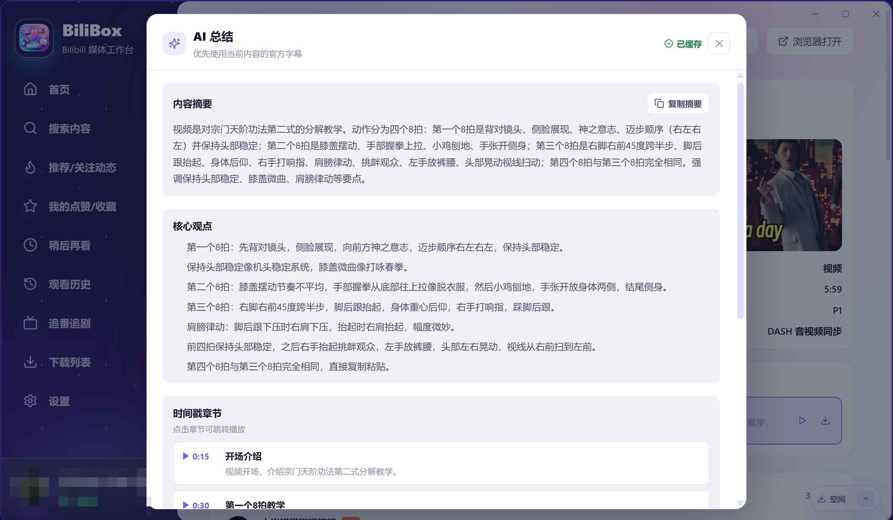
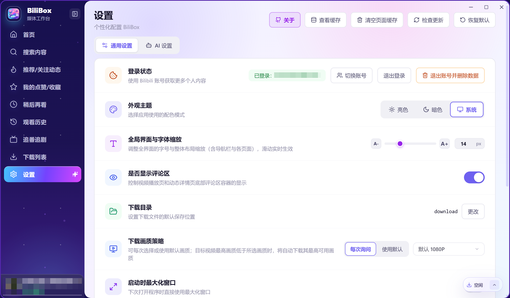
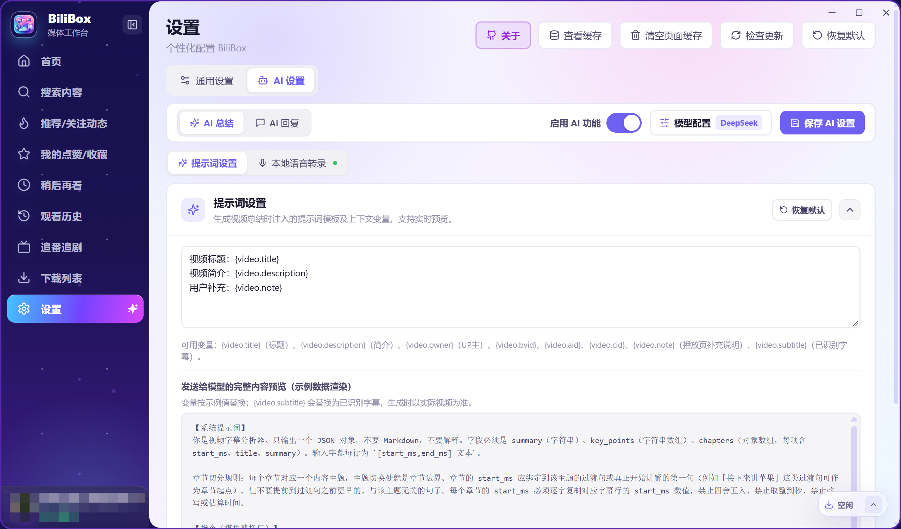

  
  <h1>BiliBox</h1>
  

    一个高颜值、桌面级、开箱即用的 Bilibili 媒体工作台。
  

  

    <strong>搜索、收藏、稍后再看、观看历史、追番追剧、在线播放、AI总结与后台下载，一站完成。</strong>
  

  

    <a href="#功能亮点">功能亮点</a>
    ·
    <a href="#界面预览">界面预览</a>
    ·
    <a href="#最近更新计划">最近更新计划</a>
    ·
    <a href="#下载发行版">下载发行版</a>
    ·
    <a href="#常见问题">常见问题</a>
    ·
    <a href="./OPEN_SOURCE.md">公开源码说明</a>
  

  

    
    
    
    
    
    
    
  

---

## 为什么选择 BiliBox

BiliBox 不是一个只会粘贴链接的下载器，而是面向日常使用的 Bilibili 桌面媒体工作台。它把常用入口、账号数据、在线播放、下载队列和本地配置集中在一个现代化桌面应用里，让找视频、看视频、存视频变成一个连续的流程。

- **轻量极速架构** - 基于 Tauri 2 + Rust 构建，内存占用极低，秒级冷启动，原生跨平台支持。
- **找·看·存一站闭环** - 聚合搜索、动态、推荐、收藏、稍后再看与追番追剧，沉浸播放与静默下载无缝衔接。
- **端云结合 AI 赋能** - 内置 AI 视频摘要与评论区智能回复助手，支持多大模型与本地离线语音转录。
- **本地优先与隐私安全** - 账号凭据、观影记录、个人配置与模型秘钥完全持久化保存在本机，纯净无广告。

## 功能亮点

- **账号与多维内容发现**：支持扫码、Cookie、内置浏览器快捷登录；无缝聚合首页推荐、关注动态、聚合搜索（支持关键词/BV号/链接与多维度筛选）、我的收藏、稍后再看、观看历史与追番追剧。
- **沉浸式播放体验**：全画质（最高 8K）动态解析切换、画中画、全屏手势，集成完整评论区互动与一键全集批量加入下载。
- **高效多任务后台下载**：多任务与多分片并发下载，内置 FFmpeg 智能混流；底部悬浮进度胶囊实时反馈，无需中断当前浏览。
- **双 AI 智能助手**：内置 **AI 视频总结**（提炼核心观点与时间戳分章节，支持多大模型与本地离线语音识别兜底）与 **评论区 AI 智能回复**（自动感知对话脉络与身份，就地生成得体回复草稿）。
- **个性化定制**：全界面基础字号与整体布局实时滑块放缩；亮色/暗色/跟随系统主题切换；下载目录、网络代理与并发自由调节。

## 界面预览

<table align="center">
  <tr>
    <td align="center" width="50%">
      <b>首页</b> 
      
    </td>
    <td align="center" width="50%">
      <b>搜索内容</b> 
      
    </td>
  </tr>
  <tr>
    <td align="center" width="50%">
      <b>推荐视频</b> 
      
    </td>
    <td align="center" width="50%">
      <b>关注动态</b> 
      
    </td>
  </tr>
  <tr>
    <td align="center" width="50%">
      <b>在线播放</b> 
      
    </td>
    <td align="center" width="50%">
      <b>稍后再看</b> 
      
    </td>
  </tr>
  <tr>
    <td align="center" width="50%">
      <b>我的收藏</b> 
      
    </td>
    <td align="center" width="50%">
      <b>观看历史</b> 
      
    </td>
  </tr>
  <tr>
    <td align="center" width="50%">
      <b>追番追剧</b> 
      
    </td>
    <td align="center" width="50%">
      <b>下载队列</b> 
      
    </td>
  </tr>
  <tr>
    <td align="center" width="50%">
      <b>AI 智能总结</b> 
      
    </td>
    <td align="center" width="50%">
      <b>AI 智能回复</b> 
      
    </td>
  </tr>
  <tr>
    <td align="center" width="50%">
      <b>设置中心 (基础与下载)</b> 
      
    </td>
    <td align="center" width="50%">
      <b>设置中心 (AI 与提示词)</b> 
      
    </td>
  </tr>
  <tr>
    <td align="center" width="50%">
      <b>专栏阅读</b> 
      
    </td>
    <td align="center" width="50%">
      <b>直播互动</b> 
      
    </td>
  </tr>
</table>

## 最近更新计划

- 🎧 **端侧/本地 AI 语音转录与大模型体验优化**：支持接入更多本地轻量模型，优化长视频语音提取切片与多任务并行转录效率。
- 📥 **合集与批量下载深度增强**：支持按分 P 命名规则模版自定义、音频/视频独立流分离导出与弹幕 XML/ASS 本地转换。
- 👥 **多账号平滑热切换与分组隔离**：支持多账号登录态快速切换与独立收藏夹/观看历史视图隔离。
- 🎨 **界面个性化与快捷键深度映射**：支持自定义快捷键控制播放/快进/音量/画中画，丰富主题配色定制。
- 🌐 **离线模式与局域网媒体推流**：支持已下载视频的局域网 DLNA/AirPlay 投屏播放与移动端互传。

## 技术栈

| 层级 | 技术 |
| --- | --- |
| 桌面容器 | Tauri 2 |
| 前端 | React 19、TypeScript、Vite |
| UI 与交互 | Zustand、Framer Motion、Lucide React、Radix UI |
| 桌面运行时 | Rust、Tokio |
| 媒体处理 | FFmpeg、FFprobe |

## 下载发行版

前往 [Releases](https://github.com/RoamerFly/Bilibili_Box/releases/latest) 页面下载对应平台的安装包或便携版。

新手可直接阅读根目录的 [使用教程.txt](./使用教程.txt)，按步骤完成登录、FFmpeg 配置、播放与下载。

| 平台 | 版本 |
| --- | --- |
| Windows | 安装版 `.exe` / 便携版 `.zip` |
| macOS | Apple Silicon `.dmg` / Intel `.dmg` |
| Linux | `.deb` / `.rpm` / 便携版 `.tar.gz` |

> macOS 首次打开可能提示“无法验证开发者”，请在 **系统设置 → 隐私与安全性** 中点击“仍要打开”。

公开仓库提供可运行的前端界面预览，完整应用请直接下载 Release。公开源码范围见 [OPEN_SOURCE.md](./OPEN_SOURCE.md)。

## 常见问题

### Q: 下载的视频在哪里？

默认在程序目录下的 `download/` 文件夹。你可以在 **设置 → 下载目录** 中修改。

### Q: 为什么下载失败？

可能原因：

1. **未登录** - 部分视频需要登录才能下载
2. **网络问题** - 检查网络连接或尝试切换代理设置
3. **FFmpeg 缺失** - 确保使用的是官方发布的完整版本

### Q: 支持哪些视频画质？

支持 240P 到 8K 共 13 个级别，具体取决于视频源可用的最高画质。

### Q: 便携版和安装版有什么区别？

| 区别 | 便携版 | 安装版 |
| --- | --- | --- |
| 数据位置 | 程序目录 `data/` | 系统应用数据目录 |
| 卸载 | 直接删除文件夹 | 使用系统卸载程序 |
| 适用场景 | U 盘携带、多设备同步 | 长期使用 |

### Q: 如何导入或备份本地数据？

便携版可直接备份程序目录中的 `data/` 文件夹；安装版的数据位于系统应用数据目录。

## 许可证

项目采用 [BiliBox Non-Commercial License](./LICENSE)，仅允许个人、教育、研究及其他非商业用途。

## 免责声明

本项目仅用于学习、研究与个人数据管理。请遵守 Bilibili 用户协议、版权规则和当地法律法规。下载或缓存内容前，请确保你拥有相应权限。
