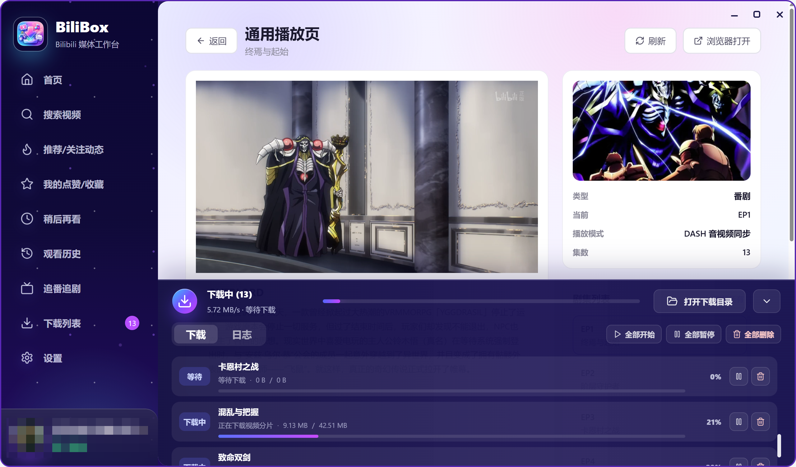

<div align="center">
  
  <h1>BiliBox</h1>

  <p>一个现代化的 Bilibili 桌面媒体工作台。</p>
  <p><strong>搜索、推荐、收藏、历史、追番、播放与下载管理，一站完成。</strong></p>

  <p>
    <a href="https://github.com/RoamerFly/Bilibili_Box/releases/latest"></a>
    <a href="https://github.com/RoamerFly/Bilibili_Box/releases"></a>
    <a href="https://github.com/RoamerFly/Bilibili_Box/stargazers"></a>
    
    
    <a href="LICENSE"></a>
  </p>
</div>

---

## 功能亮点

- 聚合搜索、推荐视频与关注动态
- 收藏夹、最近点赞、稍后再看与观看历史
- 追番追剧、UP 主页、视频与专栏详情
- 多分集播放、评论区与互动状态
- 下载队列、批量任务与底部悬浮下载栏
- 亮色、暗色与系统主题
- 页面缓存、卡片布局和显示密度设置

完整桌面应用请前往 [Releases](https://github.com/RoamerFly/Bilibili_Box/releases/latest) 下载。

## 界面预览

| 首页 | 推荐 |
| --- | --- |
|  |  |

| 聚合搜索 | 播放页 |
| --- | --- |
|  |  |

| 关注动态 | 收藏夹 |
| --- | --- |
|  |  |

| 下载列表 | 设置 |
| --- | --- |
|  |  |

## 本地界面预览

仓库中的开发模式使用本地演示数据，便于查看界面、主题、布局和交互，不需要账号信息。

环境要求：

- Node.js 20 或更高版本
- npm 10 或更高版本

```bash
npm install
npm --prefix frontend install
npm run dev
```

生产构建：

```bash
npm run build
```

构建结果输出到 `dist/`。

## 下载建议

- Windows 安装版：`Bilibili_Box-v*-windows-x64-installer.exe`
- Windows 便携版：`Bilibili_Box-v*-windows-x64-portable.zip`
- macOS Apple Silicon：`Bilibili_Box-v*-macos-arm64-installer.dmg`
- macOS Intel：`Bilibili_Box-v*-macos-x64-installer.dmg`
- Debian / Ubuntu：`Bilibili_Box-v*-linux-x64-installer.deb`
- Fedora / openSUSE / RHEL：`Bilibili_Box-v*-linux-x64-installer.rpm`
- Linux 通用便携版：`Bilibili_Box-v*-linux-x64-portable.tar.gz`

`.sig` 和 `latest.json` 用于自动更新与签名校验，普通安装通常不需要手动下载。

## 许可证

项目采用 [BiliBox Non-Commercial License](LICENSE)，仅允许个人、教育、研究及其他非商业用途。

使用本项目时请遵守所在地法律法规、平台服务条款与内容版权要求。
